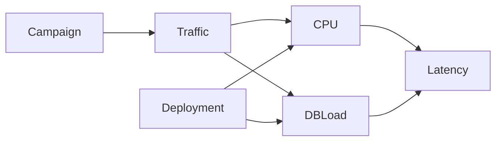

Observability usually starts with the same ritual: figure out what can go wrong, decide which signals might tell us when it does, put them on a dashboard, and wire up some alerts. The usual suspects: RUM, RED, USE, HTTPxx codes, latency percentiles, RPS, CPU %, memory usage, the load avg trifecta [1m/5m/15m], packet drops. Yes, the packet drops.

Given this vast amount of telemetry – an average enterprise produces terabytes of telemetry per day[^observability-crisis] – why do we still struggle to answer even the most basic questions about an incident?

[^observability-crisis]: [The Observability Cost Crisis](https://www.practicallogix.com/the-observability-cost-crisis-why-84-of-enterprises-are-drowning-in-telemetry-and-how-opentelemetry-is-forcing-a-reckoning)

The issue, as I see it, is that these dashboards are remarkably good at showing us symptoms, but not causes. It's funny how almost everything on the chart just correlates! It also doesn't help that, in production, "too many" things are happening at once. For example, somebody decides to run a marketing campaign that causes a surge in traffic right around the time a new deployment introduces a regression. What caused the latency spike?

RCA is then an exercise done by engineers, carefully reasoning over the metrics and piecing together a plausible story. While I get the appeal of playing "detective", it is generally error prone. Surely machines know how to learn by now?

# Can we do better?

While looking for a better way to reason about incidents, I came across [Causal Machine Learning](https://medium.com/causality-in-data-science/why-machine-learning-needs-causality-3d33e512cd37) which looked promising, and to my luck, some good folks at Microsoft and AWS have already done much of the heavy lifting in the [DoWhy](https://www.pywhy.org/dowhy/v0.10.1/index.html) library. The documentation does an excellent job of showcasing practical applications of causal modeling, check it out!

To put DoWhy into practice, imagine you're running a standard three-tier web app – frontend, backend, database.

On a normal day, your operations look something like this:
<figure style="text-align: center">
  
  <figcaption style="font-size: 15px">Fig. 1: Normal system operation</figcaption>
</figure>

Then, one day, you’re staring at this (you don't know yet if the deployment had a regression)
<figure id="incident-with-regression" style="text-align: center">
  
  <figcaption style="font-size: 15px">Fig. 2: Campaign and deployment with a regression</figcaption>
</figure>

Let me point out that this is already a pretty decent dashboard. Alongside the usual metrics, it captures ongoing events such as the start of a campaign or a new deployment thus giving you valuable context for what was happening in the system that may have caused the incident.

The dashboard however doesn't tell us which explanation to favor: Did the deployment introduce a regression? Or is this simply what the system would look like at this level of traffic?

Here's another deployment without the regression while keeping everything else unchanged.
<figure id="incident-without-regression" style="text-align: center">
  
  <figcaption style="font-size: 15px">Fig. 3: Campaign and deployment without a regression</figcaption>
</figure>

Once again, there's the same spike in traffic. Latency also shifted though not nearly as much as before. The campaign and deployment took place just as they did in the previous incident. Yet this time, the deployment has no regression.

So how does one tell them apart? In the first incident, you'd want to investigate the deployment. In the second incident, you can safely ignore it and look elsewhere.

# Hello DoWhy

### Causal Graph
A causal graph is a DAG describing the cause-and-effect relationships between different variables. DoWhy has an experimental [Graphical causal model](https://www.pywhy.org/dowhy/main/user_guide/gcm_based_inference/introduction.html) based inference which is what we're gonna use.

The graph gives the model a structure to work with. Domain experts in your organization can encode what they know about the system's relationships over time.

For the example above, here's a causal graph that should be fairly self-explanatory.

<p style="font-size: 15px" align="center"><em>A campaign may influence traffic, which in turn affects CPU usage and database load. A deployment can also affect CPU and database load independently of traffic. Both CPU usage and database load contribute to the request latency.</em></p>

One can imagine in a large organization, individual teams could build and maintain causal graphs for the systems they understand best. A platform team could then stitch these graphs together into an organization-wide view, allowing outages to be reasoned about across service and team boundaries if desirable.

Let's now look at what DoWhy has to say about the two incidents. We'll use the [Distribution Change](https://www.pywhy.org/dowhy/main/user_guide/causal_tasks/root_causing_and_explaining/distribution_change.html) recipe for this. The question it answers is:

> **Distribution Change** explains why a target variable changed between two datasets by attributing that change back to the causal mechanisms in the graph that contributed to it.

Apart from pointing to potential causes, it can also attribute the change in a variable (e.g., latency) back to the nodes in the causal graph that contributed to it, and also quantify how much each one was responsible for.

The following summarizes the distribution change, attributing the overall increase in latency across the contributing nodes. Notice that it doesn't single out a single root cause.

<figure style="text-align: center">
  
  <figcaption style="font-size: 15px">Fig. 4: Latency change attribution for <a href="#incident-with-regression">Fig. 2</a></figcaption>
</figure>

We know from Fig. 2 that mean latency increased by 100ms. In the second experiment (Fig. 3), we know the deployment introduced no regression, leaving the campaign as the source of the latency increase. The model attributed roughly 34ms to the campaign in both experiments, making the remaining 66ms in the first experiment consistent with the deployment regression.

CPU usage increased in both cases, but it was never the root cause: adding capacity might have relieved the symptom, but fixing the regression is what would have resolved the underlying problem.

<figure style="text-align: center">
  
  <figcaption style="font-size: 15px">Fig. 5: Latency change attribution for <a href="#incident-without-regression">Fig. 3</a></figcaption>
</figure>

### Footguns

Causal ML is still a tool and the literature is explicit about the possibility of surprising or misleading results. In our example, imagine the deployment itself had no regression, but there was a hidden factor affecting CPU usage (e.g., power saver mode) that wasn't defined in our causal graph. The model could still end up attributing the resulting change back to the deployment.

I'd recommend reading about [Confounders, Colliders, Mediators](https://medium.com/causality-in-data-science/confounding-colliding-d-separation-and-sleeping-with-shoes-on-8ba43c976354).

That doesn't make the approach unusable. We can continuously revise the graphs as we better understand what impacts our systems, add more telemetry, and use canary deployments to give the model a baseline to compare the rollout against.

# Benefits

### Automatic remediation

In our example, the same latency alert can have two different action items: investigate a release or accommodate more traffic. Rolling back a healthy deployment won't make the campaign go away. Adding capacity might help with the regression, but you're basically paying for the regression.

Attribution could help choose the correct remedy..

### Manageable on-calls and better postmortems

Enterprises face an awkward trade-off: keep rotations fine-grained, with every team carrying its own on-call burden, or consolidate them into fewer rotations. The former is expensive (hourly wage is a thing in some countries), the latter puts unfamiliar systems in front of whoever gets paged.

If attribution can narrow down the likely source, we could page the team best placed to investigate and include the reasoning.

### SRE
Steve Yegge once argued that only a company like Google could really pull off SRE[^sre]. Perhaps causal reasoning is one of the tools that can make the SRE model practical beyond companies with Google-scale operational expertise.

[^sre]: [Site Reliability Engineering](https://sre.google/)

# Conclusion

This demo is small and used synthetic data. Production systems might require more work. Still, the possibility of turning telemetry and domain knowledge into an explanation is a useful capability.

I hope this has intrigued you enough to question whether our current approach to observability is really state-of-the-art. Surely, what we need isn't a yet another time-series database.

HMU if you think I've got anything wrong here `:)`

---
#### _Behind the Scenes_

The synthetic data was generated with the following Python function, which returns N samples for each variable:

```python
def samples(
    n: int,
    rng: np.random.Generator,
    *,
    campaign: bool = False,
    campaign_multiplier: float = 2.0,
    deployment: bool = False,
    regression: bool = False,
) -> pd.Dataframe:
    campaign_effect = np.full(n, campaign_multiplier if campaign else 1.0)
    traffic = rng.normal(100, 8, n) * campaign_effect

    deployed = np.full(n, 1.0 if deployment else 0.0)

    # traffic naturally raises cpu
    cpu = 15 + 0.3 * traffic + rng.normal(0, 3, n)

    # new deployment adds extra cpu overhead (synthetic, so we know!)
    if deployment and regression:
        cpu += 35 + rng.normal(0, 2, n)

    cpu = np.clip(cpu, 0, 100)

    # db load mostly follows traffic
    db_load = 20 + 0.28 * traffic + rng.normal(0, 3, n)

    latency = (
        50
        + 2.0 * cpu
        + 0.5 * db_load
        + rng.normal(0, 12, n)
    )

    return pd.DataFrame({
        "traffic": traffic,
        "campaign": np.full(n, 1.0 if campaign else 0.0),
        "deployment": deployed,
        "cpu": cpu,
        "db_load": db_load,
        "latency": latency,
    })

Fig. 1: sample(100, rng, campaign=False, campaign_multiplier=None, deployment=False, regression=False)
Fig. 2: sample(100, rng, campaign=True,  campaign_multiplier=1.4,  deployment=True,  regression=True)
Fig. 3: sample(100, rng, campaign=True,  campaign_multiplier=1.4,  deployment=True,  regression=False)
```

The model never sees this generator code. It learns from the generated observations and the causal graph.
