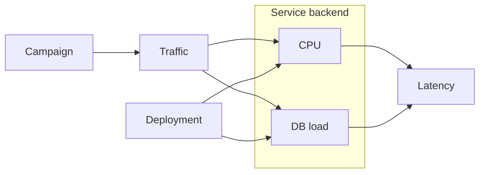

Observability usually starts with the same ritual: figure out what can go wrong, decide which signals might tell us when it does, put them on a dashboard, and wire up some alerts. The usual suspects: RUM, RED, USE, HTTPxx codes, latency percentiles, RPS, CPU %, memory usage, the load avg trifecta [1m/5m/15m], packet drops. Yes, the packet drops.

Given this vast amount of telemetry – an average enterprise produces terabytes of telemetry per day[^observability-crisis] – why do we still struggle to answer even the most basic questions about an incident?

[^observability-crisis]: [The Observability Cost Crisis](https://www.practicallogix.com/the-observability-cost-crisis-why-84-of-enterprises-are-drowning-in-telemetry-and-how-opentelemetry-is-forcing-a-reckoning)

The issue, as I see it, is that these dashboards are remarkably good at showing us symptoms, but not causes. It's funny how almost everything on the chart just correlates! It also doesn't help that, in production, "too many" things are happening at once. For example, somebody decides to run a marketing campaign that causes a surge in traffic right around the time a new deployment introduces a regression. What caused the latency spike?

RCA is then an exercise done by engineers, carefully reasoning over the metrics and piecing together a plausible story. While I get the appeal of playing "detective", it is generally error prone. Surely machines know how to learn by now?

# Can we do better?

While looking for solutions, I came across [Causal Machine Learning](https://medium.com/causality-in-data-science/why-machine-learning-needs-causality-3d33e512cd37) which looked promising, and to my luck, some good folks at Microsoft and AWS have already done much of the heavy lifting in the [DoWhy](https://www.pywhy.org/dowhy/v0.10.1/index.html) library. Their documentation does an excellent job of showcasing practical applications of causal modeling, check it out!

To put DoWhy into practice, imagine you're running a standard three-tier web app – frontend, backend, database.

On a normal day, your operations look something like this:


Then, one day, you are staring at this:


Let me point out that this is already a pretty decent dashboard. Alongside the usual metrics, it captures ongoing events such as the start of a campaign or a new deployment thus giving you valuable context for what was happening in the system that may have caused the incident.

The dashboard however doesn't tell us which explanation to favor: Did the deployment introduce a regression? Or is this simply what the system would look like at this level of traffic?

By the way, the chart above does have a regression. Here's another deployment without the bug while keeping everything else unchanged.


Once again, there's the same spike in traffic. Latency also shifted though not nearly as much as before. The campaign and deployment took place just as they did in the previous incident. Yet this time, the deployment has no bug.

So how does one tell them apart? In the first incident, you'd want to investigate the deployment. In the second incident, you can safely ignore it and look elsewhere.

# Hello DoWhy

### Causal Graph
A causal graph is a DAG describing the cause-and-effect relationships between different variables. DoWhy has an experimental [Graphical causal model](https://www.pywhy.org/dowhy/main/user_guide/gcm_based_inference/introduction.html) based inference which is what we're gonna use.

The graph gives the model a structure to work with. Domain experts in your organization can encode what they know about the system's relationships over time.

For the example above, here's a causal graph that should be fairly self-explanatory.

> A campaign may influence traffic, which in turn affects CPU usage and database load. A deployment can also affect CPU and database load independently of traffic. Both CPU usage and database load contribute to the request latency.

One can imagine in a large organization, individual teams could build and maintain causal graphs for the systems they understand best. A platform team could then stitch these graphs together into an organization-wide view, allowing outages to be reasoned about across service and team boundaries if desirable.

Let's now look at what DoWhy has to say about the two incidents. We'll use the [Distribution Change](https://www.pywhy.org/dowhy/main/user_guide/causal_tasks/root_causing_and_explaining/distribution_change.html) recipe for this. The question it answers is:

> **Distribution Change** explains why a target variable changed between two datasets by attributing that change back to the causal mechanisms in the graph that contributed to it.

Apart from pointing to potential causes, it can also attribute the change in a variable (e.g., latency) back to the nodes in the causal graph that contributed to it, and also quantify how much each one was responsible for.


# Benefits

### Automatic remediation

In our example, the same latency alert can have two different action items: investigate a release or accommodate more traffic. Rolling back a healthy deployment won't make the campaign go away. Adding capacity might help with the regression, but you're basically paying for the bug.

Attribution could help choose the correct remedy..

### Makes on-call more manageable

Enterprises face an awkward trade-off: keep rotations fine-grained, with every team carrying its own on-call burden, or consolidate them into fewer rotations. The former is expensive (hourly wage is a thing in some countries), the latter puts unfamiliar systems in front of whoever gets paged.

If attribution can narrow down the likely source, we could page the team best placed to investigate and include the reasoning.

### Better postmortems

After the incident, we'd also have an explanation to examine alongside the timeline. Did the suspected deployment actually cause the problem? Did rolling it back produce the improvement we expected? What did the model miss?

A wrong prediction by the model may hint us that we don't understand our system better. It also could simply be wrong. Human judgement still needed.

### Enables SRE

SRE[^sre], when implemented poorly, has a fundamental problem: you centralize the responsibility for responding to incidents without centralizing the knowledge required to understand them. A hundred dashboards don't magically give an SRE the application-level context they need to make sense of an ongoing incident.

[^sre]: [Site Reliability Engineering](https://sre.google/)

# Conclusion

This demo is small and used synthetic data. Production systems might require more work: relationships change, signals are missing, and the model can be wrong. Still, the possibility of turning telemetry and domain knowledge into an explanation is a useful capability.

I hope this has intrigued you enough to question whether our current approach to observability is really state-of-the-art. Surely, what we need isn't a yet another time-series database.

---
#### _Behind the Scenes_

```
Traffic ~ Normal(100, 8) * CampaignMultiplier
DBLoad  = min(100, 20 + 0.3 * Traffic)
CPU     = min(100, 15 + 0.3 * Traffic)
Latency = 50 + 2.0 * CPU + 0.5 * DBLoad
```
